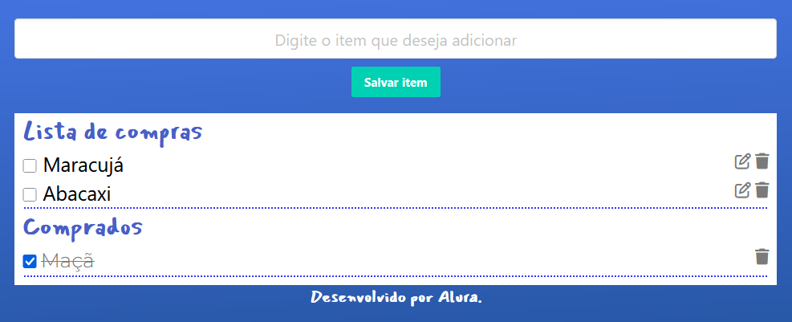

## 🛒 Lista de Compras

A **Lista de Compras** é um projeto prático e funcional onde é possível **adicionar, editar, marcar como comprado e excluir itens** de forma simples e intuitiva. Os dados são salvos no navegador usando o **localStorage**, o que permite que a lista seja mantida mesmo ao fechar a aba ou recarregar a página.

 

## 🚀 Sobre o Projeto

Este projeto foi desenvolvido durante o curso da Alura:

* "JavaScript: manipulando objetos"

A ideia central foi trabalhar a **manipulação de objetos no JavaScript**, integrando conceitos de **DOM, eventos, armazenamento local e boas práticas** no desenvolvimento de aplicações web simples, porém robustas.

## 📚 Objetivos do Curso

* Entender o que são e como **manipular objetos no JavaScript**;
* Conectar o projeto a um armazenador de dados do navegador(a **API localStorage**);
* Implementar métodos para manipulação de elementos no **DOM**;
* Conhecer características de desenvolvimento de código em JavaScript;
* Criar métodos para receber dados da pessoa usuária.

## 🛠️ Tecnologias Utilizadas

## 🖼️ Visualização do Projeto

Uma prévia das principais funcionalidades da **Lista de Compras**:

**🌐 Acesse o Projeto Online**

O projeto está disponível para visualização na **Vercel**. Clique no link abaixo para acessar:

**📋 Lista de Compras**

Site com campo para digitar o nome do item e adicioná-lo à lista de compras com um clique. Os itens adicionados aparecem listados com botão de check, editar e remover. Quando os itens são marcados como comprados são movidos para uma nova seção, mantendo organização.

